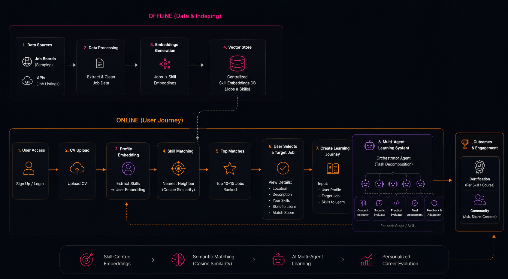

# Skill Up

Skill Up is an AI-powered career evolution platform that helps users understand where they are today, discover where they can realistically go next, and build a personalized path to get there.

Instead of treating job search and learning as two separate problems, Skill Up connects them into one continuous system:

- upload a CV
- extract skill signals from the user profile
- semantically match that profile against real job opportunities
- identify the missing skills behind a target role
- generate a personalized learning roadmap
- support progress through adaptive, AI-orchestrated learning and community interaction

In short, Skill Up closes the loop between opportunity and execution.

## The Problem

The job market is changing faster than most people can adapt.

AI is automating workflows, new roles are emerging constantly, and for many people the hardest question is no longer, "How do I find a job?" It is, "What should I learn next to stay relevant?"

Most platforms solve only one part of that problem. Job boards help users discover opportunities. Learning platforms help users consume content. Skill Up connects those layers into one intelligent product that helps users move from current profile to target role with much more clarity.

## What Skill Up Does

The experience starts with something simple: the user uploads a CV.

From there, Skill Up extracts the user's existing skills, experience, and transferable capabilities. At the same time, the platform processes job postings and understands the skills and requirements behind each role.

Instead of relying only on keyword matching, Skill Up compares users and jobs semantically. This allows the system to identify:

- exact job matches
- adjacent career transitions
- transferable opportunities
- the specific skills that already align
- the missing skills that still need to be learned

Once the user selects a target role, the platform shifts from recommendation to execution. Skill Up generates a personalized roadmap based on the gap between the user's current profile and their desired career direction.

## Product Flow

### 1. CV Upload
The user uploads their CV or resume.

### 2. Skill Extraction
The backend parses the CV and extracts structured skill signals, seniority, and supporting profile context.

### 3. Embedding Generation
The platform converts both user profiles and job postings into embeddings so it can compare them semantically rather than only through literal keyword overlap.

### 4. Semantic Matchmaking
Skill Up compares the user's profile against job requirements using embedding-based similarity and skill matching.

### 5. Ranked Opportunities
The user receives multiple matching roles and career pathways, along with matched skills, missing skills, and a transition score.

### 6. Target Selection
The user chooses a target role or pathway they want to pursue.

### 7. Roadmap Generation
The platform identifies missing skills and transforms them into a structured learning journey.

### 8. Adaptive Learning
An AI-driven, multi-agent learning system guides the user through explanation, practice, evaluation, and progression.

### 9. Community Layer
Users can connect with others learning the same skills, ask questions, share progress, and learn collaboratively.

## Architecture Overview



At a high level, Skill Up has two major layers:

### Offline intelligence layer
This layer ingests and processes job data.

- job listings are collected from external sources
- job requirements are cleaned and normalized
- embeddings are generated for job profiles
- the results are stored in a vector-enabled database for semantic retrieval

### Online user journey layer
This is the interactive product experience.

- the user uploads a CV
- the platform extracts skills and builds a user embedding
- semantic matching ranks the most relevant jobs
- the user selects a target role
- the system generates a roadmap and launches the adaptive learning experience

## Technical Intelligence, Explained Simply

Skill Up is technically credible because it is not just recommending jobs or courses in a generic way. It uses a layered intelligence stack to personalize the experience.

### Skill extraction
The platform extracts structured skill information from both CVs and job postings. This makes the system more useful than a plain text search engine because it understands what a user can do and what a role actually demands.

### Embeddings
Skill Up turns both user profiles and job requirements into embeddings. In simple terms, embeddings give the system a machine-readable representation of meaning, not just wording.

That helps the platform detect similarity between:

- skills that are related but not phrased identically
- transferable experience
- adjacent career paths
- realistic transitions rather than only exact matches

### Semantic matching
Using embeddings and skill overlap together, the platform can rank jobs based on deeper relevance. This makes the matching process more intelligent than standard keyword filtering.

### Roadmap generation
Once a target role is selected, Skill Up computes the gap between the user's current profile and the selected opportunity. That gap becomes the basis for a personalized roadmap.

### AI-driven personalization
The roadmap is not generic. It is built around the user's actual missing skills, target direction, and progression context.

### Multi-agent orchestration
The learning layer uses an AI-driven orchestration model to coordinate different learning functions across the journey. At a high level, those agents support:

- concept generation
- learning sequencing
- practical exercises
- evaluation
- progression tracking
- feedback and adaptation

The goal is not just to deliver content, but to guide the learner from understanding to application.

## Repository Structure

This repository contains two connected systems plus an integration layer:

- `frontend/` — Next.js product interface for the user journey
- `backend/` — FastAPI matchmaking backend for CV parsing, skill extraction, embeddings, and job matching
- `Agentic_learning/` — multi-agent learning system for adaptive roadmap execution
- `integration/` — a thin orchestration layer that connects matchmaking outputs to the learning system without tightly coupling both systems

## Core Stack

### Frontend
- Next.js 14
- React 18
- TypeScript
- Tailwind CSS
- Framer Motion

### Backend
- FastAPI
- SQLAlchemy
- PostgreSQL + pgvector
- Celery
- Redis

### AI layer
- skill extraction pipeline
- embedding-based semantic matching
- vector search for role retrieval
- multi-agent orchestration for adaptive learning

## End-to-End Flow

### Matchmaking pipeline
`CV upload -> parse CV -> extract skills -> generate embedding -> semantic job retrieval -> compute skill gap`

### Learning pipeline
`selected role -> prioritized missing skills -> learning request -> agent-driven curriculum -> stage-based progression`

## Demo Narrative Summary

Skill Up begins with who the user is today.

The user uploads a CV, and the platform extracts their skill signals, experience, and transferable capabilities. At the same time, Skill Up processes real job postings and understands the requirements behind each role.

Using embeddings and semantic matching, the platform compares user profiles and job requirements at a deeper level than simple keywords. That allows Skill Up to identify not only obvious matches, but also realistic career transitions and adjacent opportunities.

Once the user sees their ranked opportunities, they can select a target role. At that point, Skill Up moves from recommendation to execution: it identifies the missing skills, generates a roadmap, and launches an adaptive learning flow supported by AI-driven multi-agent orchestration.

The experience is also social. Users can learn alongside others pursuing similar skills, ask questions, share progress, and build momentum inside a community layer.

Skill Up is not just job discovery, and not just online learning. It is a more adaptive system for career evolution.

## Why It Matters

What makes Skill Up compelling is the closed-loop design.

It starts with the user's current profile.
It uses semantic AI to identify where they can realistically go next.
Then it builds a personalized path to help them get there.

That turns career growth from something vague and reactive into something structured, visible, and actionable.

## Getting Started

All services run through Docker.

### Start the full stack
```bash
docker-compose up
```

### Start infrastructure only
```bash
docker-compose up -d postgres redis
```

### Run backend migrations
```bash
docker-compose run --rm backend alembic upgrade head
```

### Run backend tests
```bash
docker-compose run --rm backend pytest -v
```

### Run frontend typecheck
```bash
docker-compose run --rm frontend npx tsc --noEmit
```

### Check backend health
```bash
curl http://localhost:8000/health
```

## Vision

Skill Up is designed around a simple idea:

people should not have to guess their next move.

By combining career intelligence, semantic matching, adaptive learning, and community-driven growth, Skill Up helps users move from uncertainty to momentum with much more confidence.
